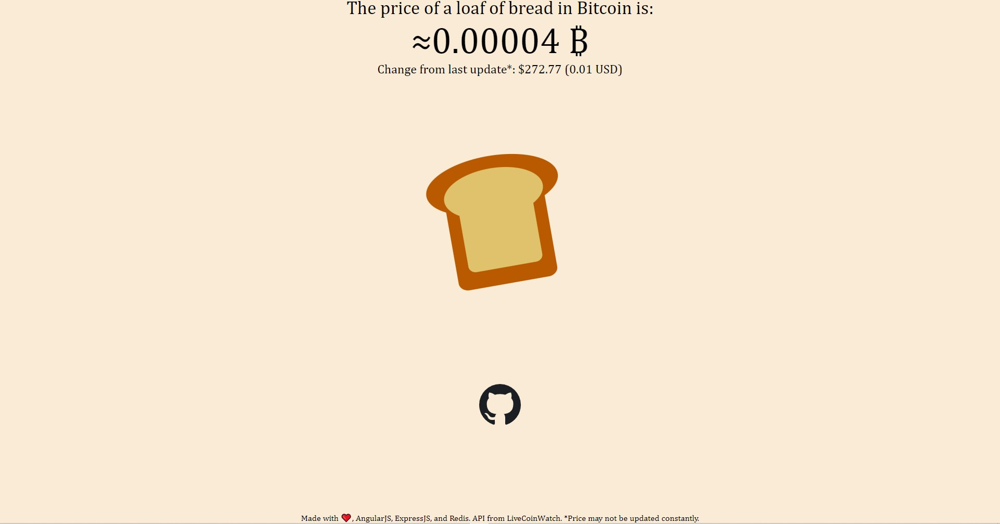

# Bitcoin Bread Project

A simple web application which displays the average price of a loaf of bread in the United States in terms of Bitcoin (BTC).

## Why?
I decided to do this project partly as a way to experiment with new technologies on the full-stack web end, as well as make something that has been on my mind for a while. You can read a mini-festo here: https://macandthoughts.wordpress.com/2022/02/06/twib-3-a-loaf-of-btc/

## Technologies
This project was a partial exploration of the REAN stack, which includes:
- [Redis](https://redis.com/) (high performance, RAM based database)
- [ExpressJS](https://expressjs.com/), a framework to handle the backend/server of web applications
- [AngularJS](https://angularjs.org/), a popular UI framework
- [NodeJS](https://nodejs.org/en/), running JavaScript on the server side versus another language

## Usage
Visit https://bitcoin-bread.herokuapp.com for a live demo of the web application. Alternatively, clone the project, and run `npm start` on the root file to get started. You can also run the front end and back end independently through Angular's CLI in the **client** folder, or standard node on the **server** folder respectively.
